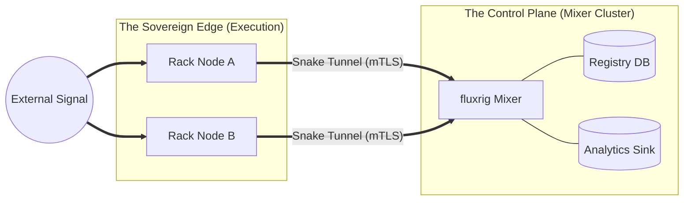

<!-- Copyright (c) 2026 JAAB Tech SAS, Uruguay All Rights Reserved -->
<!-- See https://jaab.tech -->

# Deployment architecture

**fluxrig** is designed to scale from a single developer workstation to a multi-region institutional network. Our deployment model enforces a strict separation between the **Stateless Execution Edge** (The Rack) and the **Centralized Control Plane** (The Mixer).

## Architecture tiers

1.  **The Control Plane (Mixer)**: A central orchestration node that manages policy, identity (Registry), and telemetry aggregation. In the current release, the Mixer is a **Sovereign Single Node**, with a multi-node **HA Cluster** implementation on the engineering roadmap.
2.  **The Data Plane (Racks)**: A fleet of decentralized execution nodes. While Racks are currently horizontally scalable as independent nodes, **Native Rack Clustering** is planned to enable seamless multi-node coordination at the edge.

---

## Technical reference: ports & protocols

For network administrators and SREs, the following table summarizes the project's **standard default** port and messaging mapping. All ports are fully configurable via the `fluxrig.toml` configuration or the Scenario specification.

| Component | Default Port | Proto | Purpose | Direction |
| :--- | :--- | :--- | :--- | :--- |
| **Mixer API** | `8090` | TCP (HTTP) | Centralized Control & Observability API | Inbound to Mixer |
| **Snake (NATS)** | `4222` | TCP (mTLS) | Distributed Message Bus (The Snake) | Inbound to Mixer |
| **ISO8583 IO** | `8583` | TCP | Standard Financial Industry Port | Inbound/Outbound |
| **Generic TCP** | `9000` | TCP | Standard fluxrig Demo Port | Inbound/Outbound |

All internal platform communications follow two primary subject hierarchies to ensure absolute isolation between the management plane and the operational data plane.

| Subject | Plane | Description |
| :--- | :--- | :--- |
| **`flux.agent.>`** | **Management** | Orchestration signals: Hello, Heartbeats, Scenario Updates. |
| **`flux.telemetry.>`** | **Telemetry** | High-resolution OTel signals (traces, logs, metrics). |
| **`flux.msg.>`** | **Data** | Primary data-plane business signals between gears. |
| **`flux.ctrl.>`** | **Control** | Secure control-plane signaling (Kill Switch, Hot Reload). |

## Binary strategy

To simplify operations and reduce the maintenance surface, **fluxrig** is distributed as two focused, binaries.

### `fluxrig` (The Sovereign Node)
*   **Role**: The stateless execution edge. Contains the **Rack** runtime and the operational CLI.
*   **Build**: Pure Go (Static). Zero external dependencies (no glibc requirements).
*   **Target**: Edge gateways, industrial IoT devices, and secure CI/CD runners.
*   **Footprint**: A 34 MB static binary (linux/amd64, this release). Nothing else is installed, which is the property that matters at the edge more than the size.

### `fluxrig-mixer` (The Orchestrator)
*   **Role**: The centralized control plane. Contains the **Mixer**, the entity registry, and the high-resolution analytics hub.
*   **Build**: Go with embedded C-extensions (DuckDB), which is why it is the larger of the two at 105 MB. It is not deployed to the edge.
*   **Target**: Private data centers, cloud regions, or local management hubs.
*   **Embedded Services**: NATS JetStream (Message Bus) and DuckDB (SQL Analytics).

---

## Deployment tiers

### Standard tier (Autonomous Edge)
**The Zero-Dependency Experience.** Designed for local development and single-node edge sites. The Mixer and Rack typically operate as a unified, self-contained unit.

*   **Architecture**: Local execution with embedded persistence (DuckDB).
*   **Dependencies**: Zero. No external databases or sidecars are required.
*   **Sovereignty**: All state is stored in a local, immutable write-ahead log (WAL).

### Institutional tier (Distributed Infrastructure)
**The Sovereign Network.** Designed for high-availability environments (Financial Infrastructure, Industrial Plants) requiring air-gapped operation and multi-region resilience.

*   **Topology**: Fully distributed logic. Multiple Racks connect back to a high-availability Mixer cluster via secure channels.
*   **Persistence**: Integrates with external OLAP backends (e.g., ClickHouse for high-concurrency telemetry archival).
*   **Isolation**: Optimized for air-gapped data centers with zero dependency on the public internet.

---

## Clustered resilience [Roadmap]

To ensure **Zero-Downtime** operations at the edge, institutional deployments utilize **Rack Clustering**.

*   **Stateless Scaling**: Racks share no local execution state except for the **Scenario** blueprint. This allows any node in a cluster to handle any incoming signal path.
*   **Failover**: If a node fails, traffic is re-routed by the Layer 4 Load Balancer or the NATS mesh to healthy nodes.
*   **Transactional Consistency**: The Mixer coordinates **Saga Orchestration** to ensure eventually consistent states during node failures, managing required reversals or compensations automatically.

## Rack behavior without the Mixer

The Snake, the NATS server that carries messages between Racks, runs inside the Mixer.

*   **Identity survives**: the signed Passport (`state.flux`) lets a Rack start and prove its identity without contacting the Mixer.
*   **Scenario survives**: a Rack keeps a local copy of the last scenario it applied and starts it on its own, without the Mixer, when none of its wires uses the bus. One that does waits for the bus.
*   **Recovery is automatic**: a Rack that loses the Mixer reconnects by itself, and one that started without it probes the bus and joins the Mixer when it answers, without stopping the gears it is running.
*   **Flows inside one Rack keep running**: a wire between two gears of the same Rack goes through the Rack's memory (the hot lane), so it needs no Mixer.
*   **What crosses between Racks waits for the Mixer**, and so does every wire on the guaranteed lane. See [A Rack without the Mixer](../reference/operations.md#a-rack-without-the-mixer).

A guaranteed lane local to each Rack, over a NATS leaf node, is `[Roadmap]`.

---

## Operational lifecycle: hot-reload

**fluxrig** supports the dynamic update of execution topologies (Scenarios) without requiring a full binary restart. However, for audit transparency, users should understand the current state-transition model.

### The Hot-Reload Gap (Current Limitation)
In the current release, the hot-reload of a Scenario involves a **coordinated restart of the internal Gear pipeline**.

*   **Downtime**: There is a millisecond-scale gap in signal processing while the new topology is bridged and I/O gears re-bind to their ports.
*   **Signaling**: The reload is triggered via a `ScenarioUpdate` signal on the `flux.ctrl.>` management hierarchy.
*   **Roadmap (future)**: We are engineering a "Shadow Swap" mechanism to achieve **True Zero-Downtime Reload**, where the new pipeline is initialized in parallel and traffic is cut over atomically.

---

## Deployment roadmap

| Feature | Status | Goal |
| :--- | :--- | :--- |
| **Rack Clustering** | Planned | Hardware redundancy for high-load sites. |
| **In-memory lane for wires inside a Rack** | Available | A flow that stays inside one Rack keeps running while the Mixer is away. |
| **Start without the Mixer** | Available | A Rack that starts while the Mixer is away runs its saved scenario when none of its wires uses the bus, and joins the Mixer later without stopping it. |
| **Guaranteed lane local to a Rack** | Planned | A NATS leaf node in each Rack keeps on-disk storage for the wires that ask for it while the Mixer is away. |
| **Mixer Clustering (HA)** | Planned | Multi-node Mixer for large-scale rig management (future). |
| **Containerization** | Planned | Distroless images for cloud-native orchestration (future). |

---

## Hybrid-cloud orchestration

Organizations minimizing infrastructure overhead can leverage our **Hybrid-Cloud** model. In this configuration, **JAAB Tech** operates the centralized Mixer and Analytics hub while you retain absolute ownership of the **Edge Racks**.

*   **Sovereignty**: Your business data remains on-premise (The Rack), while the complex orchestration and lifecycle management are handled as a service.
*   **Connectivity**: Racks connect to the managed Mixer via the **Snake Tunnel**, requiring no inbound firewall modifications at the edge site.

> [!NOTE]
> For institutional onboarding or hybrid-cloud architecture reviews, please **[contact the JAAB Tech engineering team](https://jaab.tech/contact)**.