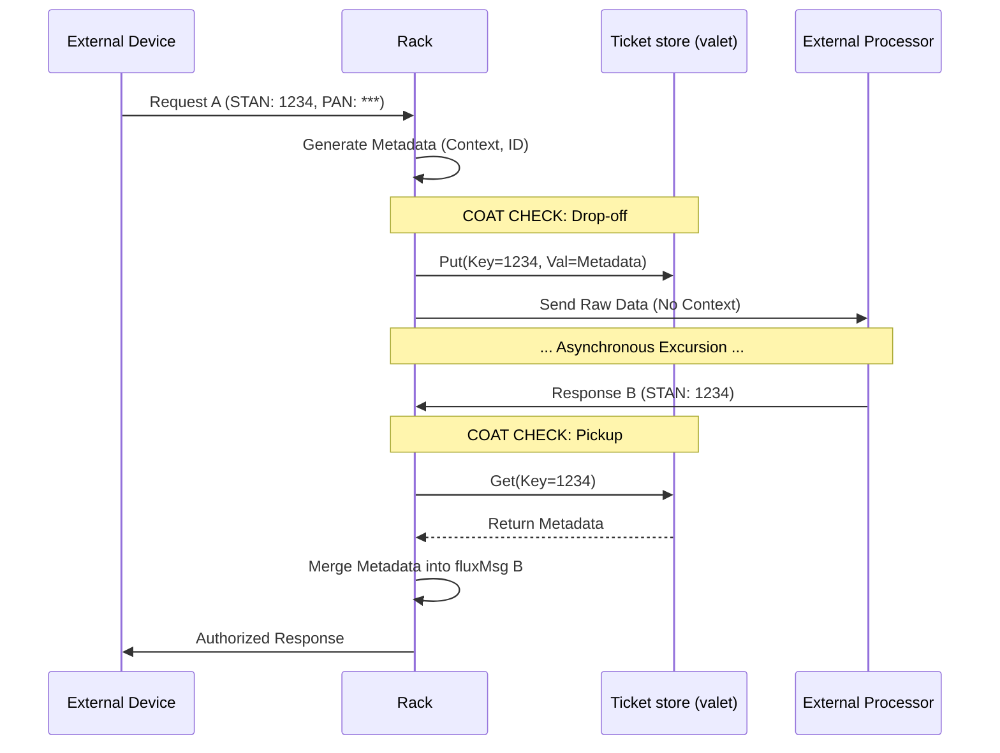

# Message flow and integrity

<!-- Copyright (c) 2026 JAAB Tech SAS, Uruguay All Rights Reserved -->
<!-- See https://jaab.tech -->

## Parallel processing and concurrency

While **fluxrig** maintains a logical sequence for each message path, the execution engine supports high-density, parallel processing.

### The goroutine-per-wire model
Unlike legacy brokers with single-threaded event loops or forked processes, the **Rack** uses Go native concurrency (Goroutines). It achieves high vertical scale on a single node.

*   **Isolated Execution**: Every defined **Wire** (subscription) in a Scenario receives its own goroutine.
*   **Automatic Parallelism**: If a Rack runs on a multi-core system, Gears across different wires execute in parallel automatically. A high-latency I/O operation on one Gear (for example, a slow database write) therefore does not block the "Fast Lane" traffic on another.
*   **Zero-Sharding Overhead**: You do not need to manually shard processes or manage thread pools. The Rack runtime handles the M:N scheduling of thousands of concurrent signal paths with minimal memory overhead (~2KB per goroutine).

### Concurrency safety
Because Gears run in parallel, **fluxrig** enforces a strict separation of concerns:
*   **Stateless Gears**: Process millions of messages concurrently without locks.
*   **Stateful Gears**: (e.g., ISO8583 Client or Coat Check) use internal synchronization primitives (Mutexes/Channels). They manage shared state safely while the platform continues to route other traffic.

---

---

## Wire directionality

Every **Wire** is **unidirectional**: it moves messages from exactly one output port to exactly one input port, in one direction only. There are no bidirectional wires. A "round trip" through the system always consists of separate one-way wires. Three rules follow:

1.  **Fan-out broadcasts.** Wiring one output port to several input ports duplicates every message to all of them. Fan-out is therefore a deliberate multicast, never a load-balancing mechanism. A gear that must choose *one* of N destinations (routing, pooling) needs one named output port per destination.
2.  **Fan-in merges.** Any number of wires may feed one input port. Their streams merge safely. A gear therefore needs only one input port per *role* of incoming message (for example, "requests to route" vs "replies to match"). The count of sources does not change this.
3.  **Bidirectionality ends at the I/O boundary.** External connections (TCP/TLS sockets) are bidirectional, but they exist only at the outer edge of I/O gears. One socket maps onto two unidirectional ports (received bytes go to `out`. Messages on `in` go to written bytes). A request/response exchange with an external endpoint uses **both ports of the same I/O gear** with a pair of wires. See [the port model](./gear.md#the-port-model) and the [ISO8583 I/O gear](../reference/gears/io_iso8583.md#architectural-signal-path) for the canonical diagrams.

---

## Wire strategies

Not all data requires the same durability profile. **fluxrig** lets you optimize the **Wire** per flow to meet performance and durability requirements.

| Strategy | Transport | Durability | Status | Industry Use Case |
| :--- | :--- | :--- | :--- | :--- |
| **Standard** | **NATS JetStream** | Persisted before it is acknowledged | Shipped | High-assurance payments, auditable IoT, finality. |
| **Turbo** | **Go channels** | Volatile, lost on restart | **Planned** | Intranode logic that does not need to survive a crash. |

The trade is durability, not a number. What a hop costs depends on the machine,
the disk and the scenario, so it is measured rather than quoted: the
[roaming tutorial](../tutorials/roaming_enrichment.md) publishes a round trip
observed on a stated machine, with what it does and does not mean.

> [!WARNING]
> **Turbo Wires (Planned)**: Turbo Wires offer sub-millisecond performance by bypassing the NATS bus for local intra-rack flows. This strategy is currently in technical design and targeted for the **future milestone**.

---

## State management: metadata vs. coat check

To solve the context loss problem, **fluxrig** uses two distinct patterns. The choice depends on whether the data stays within the trusted system mesh or crosses an external boundary.

### In-band metadata (intra-system context)
When a message moves between Gears or Racks, it carries its context in-band in the **Metadata** map.

*   **Mechanism**: Key-value pairs stored directly in the `fluxMsg` envelope using [Deterministic CBOR (RFC 8949)](https://www.rfc-editor.org/rfc/rfc8949.html).
*   **Propagation**: The metadata travels with the message. When a Rack publishes to a durable stream, it persists the entire envelope as a single atom of truth.
*   **Durability**: The underlying transport layer guarantees it with `At-Least-Once` delivery and high-availability retention.

### The coat check (stateless correlation)
Some external networks (e.g., raw TCP) do not support the `fluxMsg` envelope. When a message must leave the system for one, we use the **Coat Check** pattern.

*   **The Drop-off**: Before the request exits the Rack, the Rack serializes its metadata context. It parks the context in a **ticket store**. The store is pluggable: `memory` (the default, in-process, RAM-only) for connection-bound flows, or a shared **NATS KV** store when any instance must redeem the reply. Correlation state stays local to the Rack by default, not cluster-wide.
*   **The Ticket**: A unique identifier serves as the correlation key. The external system always returns it (such as a Transaction Stand-in (STAN) or Retrieval Reference Number (RRN)).
*   **The Pickup**: When the response message arrives, the Rack uses the "Ticket" to retrieve the parked context. It re-attaches the **same** context to the new `fluxMsg`, restoring traceability.

> [!IMPORTANT]
> **Parking is not tokenization.** The Coat Check *parks* a value. It restores the **same** value on the reply. It keeps correlation context (and, optionally, specific fields) off a leg, but it does not substitute a surrogate. **Tokenization** (replacing a PAN with a surrogate backed by a persistent vault) is a distinct, separate gear on the roadmap. Note also that a payment switch must send the PAN to the scheme to authorize, so the PAN is not parked on the primary path.

> [!NOTE]
> The **[Conductor gear](../reference/gears/conductor.md)** generalizes this pattern. It adds connection routing and reply correlation over a "valet" engine (the ticket store above). It supersedes the standalone Coat Check for switching.

---

## The context lifecycle

The following sequence illustrates the **Coat Check** pattern during a typical asynchronous transaction excursion.

---

## Control plane signaling

Beyond business data, **fluxrig** maintains a dedicated, high-priority **Control Plane Signaling** hierarchy (`flux.ctrl.>`) for out-of-band management and safety triggers.

### Message types & patterns

| Signal | Subject Pattern | Description | Impact |
| :--- | :--- | :--- | :--- |
| **Kill Switch** | `flux.ctrl.kill.>` | Emergency cessation of Gear processing. | Immediately halts the target Gear's internal loops. |
| **Conn Close** | `flux.ctrl.close.>` | Orchestrated termination of an I/O transport. | Triggers a clean socket closure and resource release. |
| **Scenario Update** | `flux.ctrl.sync.>` | Pushing a new execution topology. | Starts the [Hot-Reload Process](deployment.md#operational-lifecycle-hot-reload). |

### Security & delivery
*   **Order of Precedence**: Control messages always bypass the standard data-plane queues to ensure immediate execution, even if the primary business queues are saturated.

---

## Reliability: connectivity convergence
To keep the first messages from loss while subjects propagate, **fluxrig** runs a relentless connectivity handshake during every deployment and hot-reload.

### The relentless handshake
When a Rack starts or reloads a Scenario, it does not immediately activate the gear logic. Instead, it enters a **Convergence Phase**:

1.  **Sync Probes**: The Rack emits `FlagSyncProbe` messages (internal NATS control messages) across every defined Wire in the topology.
2.  **Propagation Loop**: The Rack re-emits these probes on `rack.handshake_interval`, which defaults to `500ms`, to cover JetStream propagation lag.
3.  **Finality Check**: The Rack waits until every path checks that it is "hot" and reachable across the distributed nodes.
4.  **Gear Activation**: Only after the Rack checks 100% convergence does it allow the business and protocol gears (e.g., ISO8583/Wasm) to start processing real-world traffic.

> [!NOTE]
> This mechanism solves the **First-Message Loss** problem in distributed messaging systems. JetStream subjects may take milliseconds to propagate to all nodes after a topology change.

---

## Reliability: sagas and compensation messages

**fluxrig** treats failures as data rather than exceptions. This allows orchestration of complex, distributed transactions without fragile locks. It prioritizes deterministic terminal states.

*   **Pattern: Optional Error Routing**: Gears *can* define a logical `.err` port for error handling. Note that this is a **Logic-Driven Pattern**: the engine provides the wiring infrastructure. The individual Gear implementation must explicitly emit problematic data to the `.err` port upon failure.
*   **Saga Pattern**: This pattern enables implementation of Sagas. A failure at a specific node triggers a compensating message (for example, a reversal or an automated alert). It restores the system to a clean terminal state.
*   **Finality Governance**: We enforce a policy where every message eventually reaches a "Success" or "Failure" state. This keeps the system self-healing, auditable, and compliant with institutional data standards.

> [!TIP]
> **Transport Abstraction**: By leveraging high-level messaging abstractions, **fluxrig** decouples business logic from the underlying NATS transport. This allows you to test complex Gear logic in-memory without a network server, ensuring technical validation during development.
