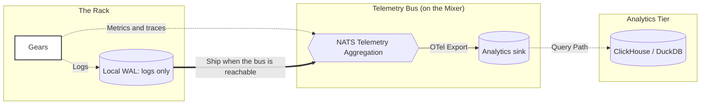

# Observability architecture

<!-- Copyright (c) 2026 JAAB Tech SAS, Uruguay All Rights Reserved -->
<!-- See https://jaab.tech -->

The **fluxrig** observability strategy is built on a non-intrusive model: **Native Telemetry Tapping**. Telemetry is taken from the execution path itself, on the same code path the message travels, rather than by a process observing it from outside.

## The zero-agent advantage

There is no sidecar and no collector to install: instrumentation is compiled into the Rack and Mixer binaries.

*   **No second process**: nothing else competes for CPU or memory on the node, and nothing else has to be deployed, upgraded or firewalled.
*   **Unified Transport**: Telemetry, logs, and control signals are multiplexed over the existing secure tunnels, simplifying firewall complexity and reducing network overhead.
*   **W3C TraceContext**: **fluxrig** natively implements the **W3C TraceContext** standard, allowing it to participate in distributed traces started by upstream load balancers or client applications.

### Resource efficiency

By embedding the telemetry tap in the single Rack binary rather than running a separate sidecar/collector process, fluxrig avoids the memory, CPU, and operational overhead of a multi-process observability stack:

| Dimension | Industry Standard (Sidecar/Collector) | fluxrig (Embedded Tap) |
| :--- | :--- | :--- |
| **Footprint** | Separate collector process(es) | In-binary, no extra process |
| **Operational Surface** | Multi-process / Sidecar | Single Binary (reduced attack surface) |

> [!NOTE]
> Comparative resource figures will be published once a reproducible benchmark is available; earlier hard numbers were illustrative and have been removed.

---

## Operational telemetry (OpenTelemetry)

**fluxrig** achieves extreme visibility by generating three distinct telemetry types for every transaction, fully compliant with the **OpenTelemetry (OTel)** standard.

1.  **Traces**: Distributed spans following a request across the entire system.
2.  **Metrics**: Latency and throughput as histograms rather than averages (latency, throughput, error rates).
3.  **Logs**: Structured, context-rich events attached directly to the transaction trace span for surgical root-cause analysis.

### Multi-dimensional correlation
To bridge the gap between business operations and technical troubleshooting, every event is correlated across three axes:

*   **`flux_id`**: The **Business Context** (The Transaction ID).
*   **`trace_id`**: The **Operational Context** (The OTel Trace ID).
*   **`entity_id`**: The **Source Context** (The specific Rack/Gear origin, utilizing UUID v7).

---

## Telemetry during an outage

Logs are written to a local write-ahead log on the Rack and shipped to the Mixer
when the bus is reachable. Metrics and traces are exported over the bus and are
not kept while it is away.

---

## Traffic prioritization and backpressure

The **Transactional Hot-Path** (Business Logic) always takes absolute precedence over the **Telemetry Path** (Observability).

### Traffic prioritization
The Rack implements a multi-lane architecture to ensure telemetry never congests critical data processing.

| Lane | Content | Priority | Mechanism | Under Extreme Congestion |
| :--- | :--- | :--- | :--- | :--- |
| **Mission-Critical Lane** | Business Logic (`fluxMsg`) | **P0** | NATS JetStream | **Guaranteed**. |
| **Audit Lane** | Transaction Logs | **P1** | Local WAL | **Delayed, Never Lost**. |
| **Metric Lane** | Metrics & Debug Spans | **P2** | Buffer Management | **Dropped** if capacity exceeded. |

### The pressure chain (Fail-to-Local)

To protect the system during backend saturation or network isolation:

1.  **Backend Saturation**: If the central analytics sink becomes unreachable, the management layer signals backpressure.
2.  **Network Congestion**: The secure tunnel detects pressure and restricts ingestion.
3.  **Local Diversion**: The Rack automatically diverts telemetry from the network path to the **Local CBOR WAL**.
4.  **Resumption**: Once the pressure clears, the Rack trickles the archived WAL data back to the central sink using a rate-limited background worker.

---

## Compliance and governance

### Deterministic sanitization
Deterministic masking `[Roadmap]` will scrub sensitive information at the infrastructure boundary before data enters the persistent observability bus, so sensitive fields (like PANs) never reach the centralized telemetry backend, significantly reducing the audit scope of the central infrastructure. Until it ships, scrubbing is the responsibility of a logic gear (for example a `bento` mapping) placed before the telemetry path.

> [!CAUTION]
> **Production Logging**: Enabling `DEBUG` or `TRACE` log levels may output raw hex payloads to the log stream. In production environments, ensure these levels are restricted to verify compliance with institutional "No Storage" security requirements.
