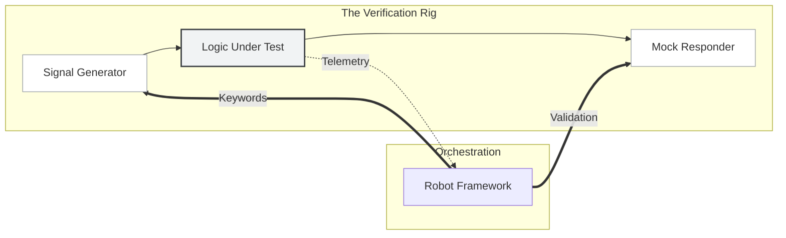

# Testing and simulation

<!-- Copyright (c) 2026 JAAB Tech SAS, Uruguay All Rights Reserved -->
<!-- See https://jaab.tech -->

**fluxrig** is more than an execution engine. It is a **Verification Rig**. The platform allows organizations to simulate complex, large-scale industrial and financial environments with absolute precision. It provides a "flight simulator" for mission-critical business logic.

## The verification rig philosophy

Every simulation in **fluxrig** stands on three architectural pillars. They ensure results translate directly to production reality.

1.  **Deterministic Execution**: While traffic can use guided randomness (fuzzing) for generation, the internal execution of the Rack is strictly deterministic. Every failure is therefore fully reproducible and debuggable.
2.  **Protocol-aware fuzzing**: Unlike generic packet fuzzers, **fluxrig** understands the semantic structure of data through the Spec Definition Language (SDL). This enables "Intelligent Chaos": valid, yet boundary-pushing signals that stress business logic without failing the transport layer.
3.  **Field-level visibility**: Throughout a simulation, the system monitors exact field-level transformations and state transitions in real-time, providing deep visibility into the logic execution path.

---

## The simulation architecture

**fluxrig** enables comprehensive validation by providing granular control over the data plane with specialized simulation components.

### Robot framework integration
**fluxrig** natively integrates with the **[Robot Framework](https://robotframework.org/)** to provide a keyword-driven validation engine. Engineers define complex transaction flows and acceptance criteria in high-level, human-readable language.

*   **Keyword Abstraction**: Abstracts technical complexity, such as ISO8583 bitmaps or mTLS handshakes, into business actions like `Inject Authorization Request` or `Verify Reversal Probability`.
*   **Flagship Automation**: The platform includes specialized testing environments for high-volume financial switching. Complex protocol logic hardens before rollout.

---

## Advanced simulation patterns

### Shadow mirroring
**Shadow Mirroring** is the primary strategy for de-risking infrastructure migrations and infrastructure modernization (The Strangler Fig Pattern).

*   **Real-time duplication**: Production signals duplicate to a shadow system in real-time through non-intrusive taps or messaging leaf-nodes.
*   **Safety Isolation**: The shadow system processes the real signal, but it blocks outbound egress automatically or redirects egress to a mock backend. This ensures zero impact on the live environment.
*   **Differential Analysis**: The system compares the output of the live vs. shadow systems. It highlights any delta in routing decisions, field values, or performance latency.

> [!CAUTION]
> **Industrial Warning: The Signaling Overload**
>
> Parallel "Digital Twin" mirroring (Shadowing) consumes physical resources on the **Rack** host. In high-throughput environments, the duplication of every signal can lead to interrupt (IRQ) contention.
>
> *   **Recommendation**: For mission-critical production environments, use **Hardware-Level Isolation** (e.g., Optical TAPs) instead of in-process mirroring to maintain absolute performance stability.

### Scenario-driven load testing
By virtualizing the internal clock and using technical macros, the rig generates thousands of varied, valid test vectors automatically.

*   **High-volume ingress**: Simulate thousands of concurrent transactions to find the breaking point of logic before a production rollout.
*   **Staged Chaos**: Intentionally introduce latencies, signal drops, or error codes from mock providers to verify compensation and retry logic.

---

## Operational lifecycle

Where this is taken seriously, simulation is not a one-time event. It is an integrated release gate.

1.  **Draft**: Engineers design a new Logic Gear or scenario topology.
2.  **Simulate**: The team pushes the configuration to the Verification Rig. The Robot suite verifies it against thousands of edge cases.
3.  **Sign**: Once validation passes, the team cryptographically signs the configuration. It bundles the configuration into the **Passport (`state.flux`)**.
4.  **Deploy**: The team distributes the signed Passport to the edge fleet through the **Snake Tunnel**. Only verified logic ever runs in production.
