# Project governance & contribution

Welcome to the **fluxrig** institutional engineering hub. This section defines the governance model, contribution workflows, and licensing boundaries for the project. Our goal is to maintain a open-core ecosystem where architectural integrity, operational safety, and **Technical Autonomy** are never compromised.

To start contributing, follow the standard build and test cycle:

```bash
# Clone & Setup
git clone https://github.com/jaab-tech/fluxrig.git
cd fluxrig

# Build Toolchain (Binaries + Catalog)
make build

# Add to PATH (Optional but Recommended)
export PATH=$PATH:$(pwd)/bin
```

## Local validation loop
Before submitting a Pull Request, verify your changes using the institutional validation loop:

```bash
make lint       # Security & Style check
make test       # Core Logic check
make test-robot # Protocol Integrity check
make regression # System E2E check
```

---

## The developer journey
Navigating a orchestration platform requires a clear roadmap. We maintain an institutional four-stage process from induction to production.

```mermaid
graph LR
    A["Architectural Induction"] == "Setup Environment" ==> B["Implementation"]
    B == "Writing Gears/Logic" ==> C["Verification"]
    C == "CI/Regression Pass" ==> D["Contribution"]
    D == "PR & Sign-off" ==> E["Release"]

    %% Institutional Palette
    style A fill:#f1f3f4,stroke:#3c4043,stroke-width:2px;
    style B fill:#f1f3f4,stroke:#3c4043,stroke-width:2px;
    style C fill:#f1f3f4,stroke:#3c4043,stroke-width:2px;
    style D fill:#f1f3f4,stroke:#3c4043,stroke-width:2px;
    style E fill:#1a73e8,stroke:#1a73e8,stroke-width:3px,color:#fff;
```



### Phase: Architectural induction
Start by aligning your local workstation with the **[Environment & layout](environment.md)** guide. You will need a "Dual Head" setup (Mixer + Rack) to verify logic end-to-end.

### Phase: Implementation
Follow the **[Developing specialized gears](../tutorials/writing_gears.md)** tutorial. Ensure all new code adheres to the **[Engineering standards](standards.md)**, focusing on context propagation, error wrapping, and structured logging.

### Phase: Verification
We maintain a "Hard Engineering" posture. Every contribution is a reflection of the system's overall reliability and is not complete until it passes every verification layer:

*   **Unit & Integration**: `make test` (Minimum 60% coverage).
*   **Protocol Integrity**: `make test-robot` (Real-world signal validation via Robot Framework).
*   **System Regression**: `make regression` (Full E2E parity).

---

## Governance & integrity

### Developer Certificate of Origin (DCO)
To protect the open-source integrity and maintain clear licensing boundaries, **fluxrig** requires a **[DCO 1.1](https://developercertificate.org/)** sign-off on every commit. This is a legally binding statement that you have the right to submit the code.

### AI code hygiene (Human accountability protocol)
We embrace AI-assisted engineering but maintain absolute human accountability. AI-generated code is treated as a third-party dependency:

1.  **Deterministic Validation**: Every AI-assisted contribution must be functionally validated via the full institutional test suite.
2.  **Architectural Curation**: The human author must ensure AI-generated blocks adhere to the project's **[Engineering standards](standards.md)** and naming conventions (**Mixer**, **Rack**, **Gear**).
3.  **Institutional Accountability**: The human engineer signing the **DCO sign-off** takes full responsibility for the code's performance, security, and long-term maintainability. 

> [!IMPORTANT]
> We view AI as a augmentation tool, but the **Human Architect** remains the final arbiter of what the system does.

### Dependency hygiene
We maintain strict compliance to ensure no "License Contamination":

*   **Permissive Linkage**: Only libraries with Apache 2.0, MIT, or BSD-style licenses are permitted.
*   **AGPL Boundaries**: External services (e.g., Grafana) are accessed solely via network protocols. **Never** link against AGPL code.

---

## Licensing & commercial strategy

**fluxrig** operates under a **Loose Open Core** model. The boundary is a
principle rather than a list, so that it stays legible as the product grows.

*   **Foundation (Apache 2.0)**: The core engine (`fluxrig`, `Rack`, `Mixer`) and every Gear published in the [open repository](https://github.com/jaab-tech/fluxrig). The commitment is directional: **what is published under Apache 2.0 stays under Apache 2.0**, in that version and in the ones that follow. Nothing already open is withdrawn, relicensed, or moved behind a paywall later.
*   **Commercial**: Capability beyond that set. Operational surfaces such as a visual console, role-based access control and audit logging; long-term analytics; development and certification tooling; specialised or licensed protocol dialects; and custom engineering. Some of it sits on the production path and some of it does not, so the line is not "free until the traffic is real". It is simply what is in the open set and what is additional to it.

Licensing terms are stated per component, on its own page.

### Community engagement

*   **[Discord](https://discord.gg/drwSCCWFV7)**: Real-time architectural collaboration.
*   **[GitHub Issues](https://github.com/jaab-tech/fluxrig/issues)**: Official institutional tracking.
*   **Code of Conduct**: Decision making is based strictly on technical merit and benchmarked reality.