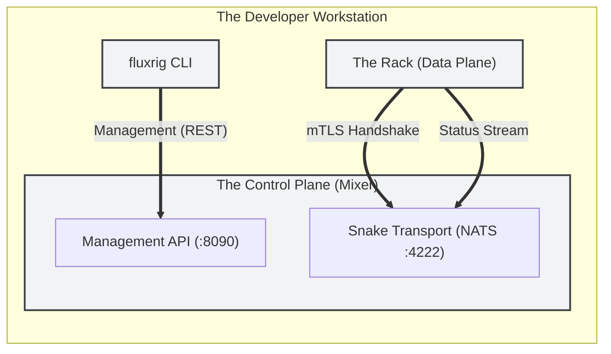

# Engineering environment and layout

This guide provides the architectural roadmap for navigating the **fluxrig** repository and configuring a professional engineering environment. We adhere to **Architectural Autonomy** principles, ensuring that every developer workstation functions as a complete, autonomous validation environment.

## Standard Go project layout

**fluxrig** follows the **Standard Go Project Layout** (`cmd`, `pkg`, `internal`) to ensure strict separation of concerns between entrypoints and library logic.

### Repository map

```text
/
├── cmd/                # Entrypoints (Platform Binaries)
│   ├── fluxrig/        # The Rack / Admin CLI
│   └── fluxrig-mixer/  # The Control Plane (Orchestration & API)
│
├── pkg/                # Public Libraries ("The Kit")
│   ├── sdk/            # The Gear contract: NativeGear, GearContext
│   ├── gears/          # The gear factory and every built-in gear
│   ├── fluxmsg/        # The FluxMsg primitive (CBOR, UUID v7 ids)
│   ├── runtime/        # Data plane: gear lifecycle on a Rack
│   ├── mixer/          # Control plane: app, REST API, controllers
│   ├── manager/        # The content-addressable store for specs and scenarios
│   ├── snake/          # The embedded NATS JetStream server
│   ├── bus/            # The Bus interface over it, mockable in tests
│   ├── pki/            # Ed25519 cluster key, passports, envelopes
│   ├── store/          # DuckDB registry and telemetry persistence
│   ├── telemetry/      # OpenTelemetry provider, batching, WAL
│   ├── viz/            # Generated views: protocol reference, LikeC4
│   ├── wasm/           # Wasm catalog and signature verification
│   ├── config/         # koanf loaders and every default
│   └── idgen/          # UUID v7 (RFC 9562) time-ordered ids
│
├── examples/           # Working scenarios, specs and config samples
└── test/               # E2E (shell) and integration (Robot Framework)
```

`pkg/` holds more than this; `go doc ./pkg/...` is the full list. There is no
`internal/` directory: every package here is importable, and the API surface is
kept deliberate rather than enforced by the compiler.

### Core philosophy
1.  **Clean Core**: The primary repository contains only the build artifacts and protocol libraries.
2.  **Deliberate API surface**: everything under `pkg/` is importable, so what goes there is a decision rather than an accident.

---

## Local "dual head" environment

For standard development, we use a **"Dual Head"** topology: running both the **Mixer** (Control Plane) and **Rack** (Data Plane) on a single workstation.

### Architecture diagram



### Setup orchestration
The Mixer provides the transport layer locally by embedding NATS JetStream.

1.  **Start Control Plane**:
    ```bash
    cp examples/configs/fluxrig-mixer.toml.example fluxrig-mixer.toml
    ./bin/fluxrig-mixer -c fluxrig-mixer.toml
    ```
    *The Mixer initiates the local transport layer (NATS) and exposes the internal registry.*

2.  **Start Data Plane (Rack)**:
    ```bash
    cp examples/configs/fluxrig.toml.example fluxrig.toml
    ./bin/fluxrig rack -c fluxrig.toml
    ```
    *The Rack completes the **Snake Link** handshake and enters the operational state.*

3.  **Manage Fleet**:
    ```bash
    ./bin/fluxrig racks                    # what the Mixer has registered
    ./bin/fluxrig admin racks approve <id>  # let a pending one in
    ```

---

## Institutional stack (Tooling invariants)

To ensure deterministic builds across the engineering fleet, all workstations must adhere to the following stack:

*   **Compiler**: Go 1.26+ (Strictly enforced via `go.mod`).
*   **Linters**: `golangci-lint` v1.60+ and `gosec` for security audits.
*   **Infrastructure**: Docker with **Testcontainers** support for Tier B/C validation.
*   **Cryptography**: **Cosign** for artifact signing and verification.

> [!NOTE]
> **Technical Autonomy**: The **fluxrig** repository is designed for **Air-Gap Readiness**. All critical dependencies are vendored or manageable via local caching, ensuring the Factory can operate without external internet dependencies.

---

## Toolchain and automation

We use `make` as the universal entrypoint for all developer operations.

| Command | Role |
| :--- | :--- |
| **`make build`** | Compiles binaries (Rack, Mixer, CLI) and generates catalog. |
| **`make test`** | Execution of the Go unit test suite with race detection. |
| **`make test-robot`** | Execution of the Robot Framework protocol validation suites. |
| **`make regression`** | Execution of the full system E2E regression suite. |
| **`make lint`** | Runs `golangci-lint` and `gosec` security audits. |
| **`make openapi`** | Generates the OpenAPI YAML spec from Mixer code. |
| **`make clean`** | Wipes build artifacts, test logs, and local persistence data. |

### Compilation flags (CGo)
When building binaries manually, note the following environment variable invariants:

*   **The Rack / CLI (`fluxrig`)**: Pure static Go. Must be compiled with **`CGO_ENABLED=0`** for Distroless compatibility.
*   **The Mixer (`fluxrig-mixer`)**: Embedded databases. Must be compiled with **`CGO_ENABLED=1`** to link the DuckDB engine.
*   **The regression suite**: needs the **`duckdb` CLI** on the PATH. Four suites read the Mixer's store with it to check what was actually persisted. `make regression` refuses to start without it rather than reporting a Rack that never registered.
