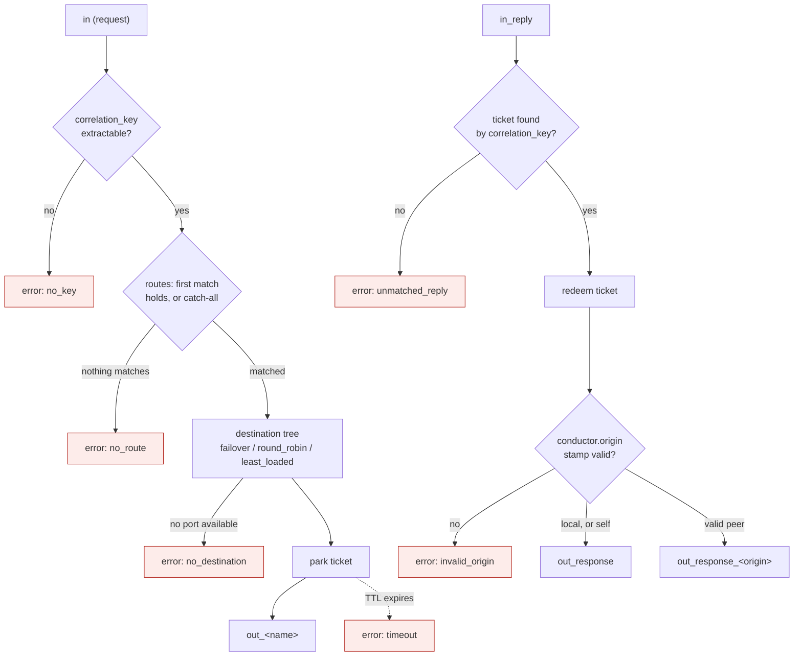

<!-- Copyright (c) 2026 JAAB Tech SAS, Uruguay All Rights Reserved -->
<!-- See https://jaab.tech -->

# Conductor gear

> [!NOTE]
> The Conductor routes each request across a destination tree, correlates the reply, handles timeouts, and hands off across regions. The payment-switch e2e and the Conductor Robot suites check it. It generalizes the [Coat Check gear](coatcheck.md) pattern. Coat Check stays as the lightweight option for single-leg field parking (see [Related](#related)). A per-destination circuit breaker and peer heartbeats are `[Roadmap]` refinements, marked where they appear below.

The `conductor` Gear is the transaction switching layer of a payment mixer. It routes each request to one of several upstream connections. It holds transaction state under a ticket while the request is in flight. It matches the reply when it returns. It emits a timeout event when no reply returns.

Like an orchestra conductor, it directs which section plays (connection routing). It cues entrances and keeps time (reply correlation and timeouts). It holds the ensemble together (transient transaction state).

## Request and reply flow



Every path off the happy line (red) leaves on the `error` port with the reason named. See [Error handling](#error-handling) for what each one means and carries. `park`/`redeem` are the [ticket store](#correlation-and-tickets) doing its job in the background, not a wire.

## Reference

`fluxrig gears doc conductor` generates the identity, ports, and configuration below from the gear's manifest, so they stay in lockstep with the code.

<!-- AUTOGEN:manifest:conductor START (generated by `fluxrig gears doc conductor`. Do not edit by hand) -->

| | |
|---|---|
| **Type** | `conductor` |
| **Category** | logic |
| **Status** | stable |
| **Terminus** | opaque |

Transaction switch: routes each request to a destination tree, correlates the reply under a ticket, and surfaces timeouts on the error port.

**Ports**

| Port | Direction | Role | Summary |
|---|---|---|---|
| `in` | input | request | Requests to route (from the local terminal path or a peer Conductor). |
| `in_reply` | input | reply | Structured replies to match to their open tickets. |
| `out_<name>` | output (dynamic) | request | A request toward one destination (an uplink leg or a peer Conductor). |
| `out_response` | output | response | Matched, restored response toward the local origin. |
| `out_response_<origin>` | output (dynamic) | response | Response toward the peer Conductor identified by the in-band origin stamp. |
| `error` | output | error | Abnormal outcomes (no route, no destination, timeout, unmatched reply) as the original message annotated with error.reason. |

**Configuration**

| Field | Type | Required | Default | Description |
|---|---|---|---|---|
| `correlation_key` | array | yes | - | Dotted-path or alias fields forming the unique per-transaction key (e.g. iso8583.field.11). |
| `routes` | array | yes | - | Ordered routing table: the first route whose match predicate holds selects the destination tree. A route with no match is the catch-all. |
| `known_origins` | array |  | - | Optional allowlist of peer Conductor names this gear will route a reply back to, by the origin stamp a request arrived with. Every origin is always checked against a safe identifier format regardless. Naming peers here additionally rejects one that is not an expected peer, rather than routing to whatever string arrived. |
| `origin` | string |  | - | This Conductor's name in the mesh. It is required only when it hands requests to, or serves requests from, other Conductors. |
| `park_fields` | array |  | - | Optional fields to detach from the outbound leg and restore on the reply. |
| `valet` | object |  | - | Correlation-engine (ticket store) settings: store backend and ticket lifetimes. |
<!-- AUTOGEN:manifest:conductor END -->

## Planned capabilities

- **Connection routing**: named output ports, each wired to exactly one destination. Each route declares a destination tree. Strategy nodes (`failover`, `round_robin`, `least_loaded`) compose freely, and leaves are output ports. A leaf is just a port, whether it leads to a local uplink leg or to another Conductor in a different region. Locality is therefore a wiring concern, invisible to the tree. Arbitrary nesting expresses every policy without special cases. Examples: a `least_loaded` local pool above a cross-region leaf, and a `round_robin` pool of remote regions under a `failover` node.
- **Reply correlation** (always on): each in-flight request parks a ticket holding its return context, keyed by a configured correlation tuple. The gear matches the reply and routes the response home. Where tickets live is a configurable strategy, not a fixed shared store. See [Ticket store strategy](#ticket-store-strategy) and [Correlation and tickets](#correlation-and-tickets).
- **Timeout handling**: when a ticket's TTL expires without a matching reply, the Conductor emits the original request on its `error` port. It never authors a response itself. A downstream gear can then answer the terminal and originate a reversal. See [Error handling](#error-handling).
- **Field parking** (optional overlay, the Coat Check heritage): detach configured fields from a chosen downstream leg and reattach them on the reply. This is opt-in for flows that must keep specific fields off a specific leg. It is not the primary path (a switch must send the PAN to the scheme to authorize). It is not tokenization. Tokenization substitutes a surrogate value by rule and is a separate, future gear. See [Security and compliance](#security-and-compliance).
- **Route matching**: per-route predicates on decoded fields, with an explicit default/catch-all. See [Route matching](#route-matching).

## Ports

The port list and roles are in the generated [Reference](#reference) above. The
notes below cover the semantics that table cannot:

- `in` and `in_reply` are fan-in (the local terminal path and a peer Conductor both feed them).
- `out_response_<origin>` carries responses for requests another Conductor handed off, keyed by the in-band origin stamp (see [Peer response routing](#peer-response-routing-the-origin-stamp)).
- `error` carries the original `fluxMsg` annotated with `error.reason` and return context, never a synthesized response (a downstream gear authors any decline/reversal, see [Error handling](#error-handling)).

There is no separate port kind for remote peers. A destination is a destination. Whether `out_<name>` reaches a local codec+IO leg or another Conductor's `in` is a wiring choice. "Peer" is a wiring pattern (wire one Conductor's `out_<name>` to another's `in`, and its response back toward the first), not a feature of the gear.

The port surface follows a general fluxrig principle: outputs scale with destinations, inputs scale with message roles. One output port feeds exactly one destination (wiring an output to several inputs would broadcast), so every destination and return path gets its own `out.*`. Any number of sources may feed one input port (fan-in merges safely), so the Conductor needs only one input per role. `in` means "route this request". `in_reply` means "match this reply". This holds whether the source is a local leg or a neighbouring Conductor. The arrival port tells the gear the message's role. The gear needs no payload inspection.

## Deployment constraints

- The Conductor and the uplink I/O gears it drives MUST be co-deployed on the same Rack. This keeps the routing hop local. Just as important, co-deployment lets availability sensing bind each destination to its local link-state (`conn.up`/`conn.down`). The Conductor treats a destination that crosses the Rack boundary as remote. Today that local hop runs over the standard NATS transport. An in-process fast lane (GoChannel) shortens it from milliseconds to microseconds. That lane is on the roadmap as an optimization, not a requirement. Cross-region traffic is explicit: an `out_<name>` wired to a Conductor on another Rack transits the Snake.
- Correlation state is local to each Conductor by default. Sharing it across instances is opt-in via the `shared` ticket store (see [Ticket store strategy](#ticket-store-strategy)), not an always-on assumption.

## Route matching

The Conductor evaluates `routes` in order. It uses the first route whose `match` predicate holds. A route with no `match` key is the catch-all, and always holds, so it must be last: nothing after it can ever be reached.

```yaml
routes:
  - name: "scheme-a"
    match: { field: "iso8583.field.2", prefix: "4" }    # PAN range handled by scheme A
    destination:
      failover: ["out_scheme_a", "out_scheme_a2"]
  - name: "scheme-b"
    match: { field: "iso8583.field.2", prefix: "5" }
    destination:
      failover: ["out_scheme_b"]
  - name: "default"                                       # no match: catch-all, must be last
    destination:
      failover: ["out_scheme_a"]
```

A `match` predicate has two keys:

*   **`field`** (required): a dotted-path or alias, resolved the same way as `correlation_key` (e.g. `iso8583.field.2`, or a codec alias like `card.pan`). A message where the field is absent never matches.
*   **`prefix`** (optional, default `""`): the route matches when the field's value, rendered as a string, starts with this prefix. An empty prefix matches any message where the field is present, whatever its value. It routes on "this field exists" alone.

This is the only match shape today: one field, one string prefix. There is no exact-value, numeric-range, or regex match, and a single route cannot test more than one field. A policy that needs more than a prefix split routes on a field a preceding logic gear computes for that purpose. It matches on that field instead.

## Selection strategies

Each route's `destination` is a tree. Interior nodes are strategies. Leaves are output ports. Evaluation starts at the root. A node picks one of its available children, recursing until it reaches a port. A subtree is available when any port beneath it is available. A port's availability comes from the sensing model below.

*   `failover` tries its children strictly in order. The first available child wins. Priority is list order.
*   `round_robin` distributes requests equally: available children take turns. Use it when children are interchangeable and healthy. It stays blind to how each one is actually performing.
*   `least_loaded` distributes waiting equally: the transaction goes to the child with the fewest in-flight transactions (for a subtree child, the sum beneath it). The Conductor already knows this number for free. Every routed request parks a valet ticket. Every matched reply (or timeout) redeems one, so in-flight per port is tickets parked minus tickets redeemed there.

```yaml
destination:
  failover:
    - least_loaded: ["out_scheme_a", "out_scheme_a2"]   # prefer the local pool
    - round_robin: ["out_west", "out_north"]            # then balance across regions (each wired to a peer Conductor)
```

Worked example (figures illustrative, not benchmarks). Region east pools two scheme A endpoints that normally answer in roughly 80 ms. Endpoint 2 degrades and starts answering in roughly 800 ms. Under `round_robin`, both still receive 50% of the traffic, so half of all transactions queue behind the slow link. Under `least_loaded`, endpoint 2's in-flight count grows (requests arrive faster than its replies drain), so new transactions drift to endpoint 1. Traffic self-balances in proportion to each endpoint's actual current throughput, with no configured weights. In-flight depth rises seconds before timeouts start firing. That rise makes `least_loaded` a leading indicator that steers around a slowing endpoint. The circuit breaker (`[Roadmap]`, below) removes a dead one. A parent `failover` node advances when a whole subtree drains.

Defined semantics:

*   **Ties** (including cold start, when all counts are zero): round-robin among the tied destinations, so `least_loaded` degrades gracefully into fair distribution while everything is healthy.
*   **Timeouts decrement**: an expired ticket redeems like a reply, so a destination's count reflects genuinely outstanding work. A zombie endpoint (accepting requests, never answering) therefore oscillates between looking idle and accumulating timeouts. Detecting and removing it is the circuit breaker's job (`[Roadmap]`), not the load counter's.
*   **Remote peers**: when an `out_<name>` leads to a Conductor on another Rack, its in-flight count covers the whole remote path. That path includes Snake transit, the peer's routing, and its endpoint. Compare that whole-path count when balancing across regions under one node.

## Availability sensing

A destination is "available" when the Conductor believes a request emitted on that port can currently reach its endpoint. Three mechanisms feed that belief, layered from fastest to most conservative. Only the first is implemented today. The other two are `[Roadmap]`. Until they ship, the Conductor treats a remote or unbound destination as unconditionally available.

1.  **Link-state signals (local uplink legs)** (implemented): each uplink I/O gear publishes its connection state (`conn.up` / `conn.down`, with `conn.id`) on the Control Plane (`flux.ctrl.>`). That is the same channel that today carries the `conn.close` kill switch, in the opposite direction. The Conductor subscribes and marks the leg's destination port available exactly while its socket is up. Reaction is immediate on disconnect.
2.  **Peer heartbeats (remote destinations)** `[Roadmap]`. Peer Conductors heartbeat over a shared liveness channel. The channel follows the same pattern the Registry uses for Rack liveness, independent of the ticket-store choice. A stale heartbeat marks every port toward that peer unavailable. Loss of the Snake itself surfaces locally as a bus disconnect and has the same effect.
3.  **Outcome circuit breaker (both, safety net)** `[Roadmap]`: link-state cannot detect a zombie endpoint (socket up, scheme dead). Per destination, consecutive ticket timeouts open a circuit breaker that marks the port unavailable. After a cool-down, a limited number of probe transactions (half-open) either close it or keep it open. This also covers anything the first two mechanisms miss.

`least_loaded` uses the Conductor's own in-flight ticket count per destination. The count needs no extra instrumentation. Emitting availability transitions as `flux.` metrics and Control Plane events is `[Roadmap]` (see [Operations](#operations)).

### Binding destinations to link state

The Conductor never guesses (and its own config never tells it) which I/O gear serves a destination. The scenario already knows that. A destination port is typically wired to a codec, not to the I/O gear itself. At scenario activation the Rack runtime walks the wire graph downstream from each Conductor output port. It passes through transparent single-path gears (codecs). It stops at a terminus:

*   A local I/O gear: the port is bound to that gear's `conn.up` / `conn.down` signals. A client-mode I/O gear owns exactly one connection, so gear-level state is connection state.
*   The Rack boundary (an `out_<name>` leading to another Conductor): there is no local socket to watch. The port is bound to the peer-heartbeat mechanism (`[Roadmap]`). Crossing the boundary during the walk is precisely what makes a destination remote.
*   No unambiguous terminus (a fork mid-path, or a leg that does not end in an I/O gear). The port then falls back to circuit-breaker-only sensing (`[Roadmap]`). Activation logs a warning.

The runtime recomputes the binding on every activation. It delivers the binding through the gear context, so it always matches the live wiring, including after a scenario reload. Keeping this derivation in the runtime, rather than duplicating topology in Conductor configuration, removes an entire class of drift. Rewiring a leg can never leave the Conductor watching the wrong socket. An explicit per-port override remains available as an escape hatch for exotic paths, not as the primary mechanism.

## Correlation and tickets

A ticket is the state the Conductor parks for an in-flight transaction so it can match the reply and route the response home. Two things must be defined precisely:

*   **Correlation key.** You configure the key that links a reply to its request. Never assume it. A single field (e.g. STAN, DE 11) is never unique on its own. STAN wraps at 999999. Values repeat within a day. The key is a tuple of fields (`correlation_key: ["iso8583.field.11", "iso8583.field.7", "iso8583.field.32", "iso8583.field.41"]`: STAN, transmission date/time, acquirer ID, terminal ID). Choose the tuple so it stays unique for the lifetime of a ticket. Each entry names a dotted path (or codec alias such as `stan`). The gear resolves it against the structured message, not against a bare wire field number. On the reply, the Conductor extracts the same tuple. A reply whose key matches no open ticket leaves on `error` (a late or unsolicited reply).
*   **Duplicate / retransmission.** A request whose key matches a ticket that is still open is a retransmission. The Conductor does not double-route it: it attaches to the existing ticket (the terminal receives whatever the first attempt eventually yields). A request whose key matches a ticket already closed within the `retain_after_close` window (default `5s`) gets its answer from the retained outcome. This is the switch equivalent of an idempotency key.
*   **What the ticket holds.** By default the ticket holds only return context. It holds the origin (which terminal connection / `conn.id`), the chosen destination, the deadline, and the correlation key. The gear parks no sensitive fields by default (see Security). Field parking is a separate, optional overlay.

## Ticket store strategy

The scenario declares the ticket location (`valet.store`). The binary does not fix it. The right choice depends on the protocol and deployment, not preference. There is one store per Conductor.

| `store` | Fast path | Store independent of the Mixer | Survives Conductor crash | Any instance can redeem | Fits |
|:---|:---|:---|:---|:---|:---|
| `memory` (default) | RAM | yes | no | no | connection-bound replies, clients that retransmit, short TTLs (e.g. ISO 8583 terminals) |
| `local_durable` `[Roadmap]` | local WAL | yes | yes | no | long-lived, no-retry, or side-effectful correlation (async callbacks, job/command acks) |
| `shared` `[Roadmap]` | NATS KV | no (needs the KV) | yes | yes | an external load balancer without sticky affinity, or replies that arrive out-of-band on a different connection |

Choose by asking: is the reply carried back on the same connection as the request, or can it arrive out-of-band? Is there an external load balancer without stickiness? Does the client retransmit on timeout, or would an orphaned reply hang forever? Is the correlation window seconds or hours? Are there irreversible upstream side effects? A connection-bound reply with a retransmitting client (the classic terminal switch) needs nothing more than `memory`. Out-of-band replies or cross-instance redemption need `shared`.

**One store per Conductor, keyed by the correlation tuple.** On a reply the Conductor has only the reply in hand. It extracts the key, finds the ticket, and learns the route from the ticket. The route is therefore an output of the lookup and cannot select the store (that would be circular). Partition the store only by a function of the key. Use a hash for scale, or a key-embedded attribute such as tenant/region for residency. Never partition it by content route. If two legs genuinely need different stores, use two Conductors. Each reply arrives on a wired, deterministic path to its Conductor.

**Cross-region handoff is in-band.** When a request crosses to a Conductor on another Rack, its return context travels with it (fluxMsg metadata over the Snake). The receiving Conductor treats it like any other ingress and routes its response home. This context is internal. The gear strips it before any external hop. An external system must never see internal routing state and would not preserve it anyway. Each external leg parks its own ticket keyed by whatever the external system echoes back (STAN/RRN/...). That leg's `store` governs its durability and sharing.

### Peer response routing (the origin stamp)

The concrete mechanism behind `out_response_<origin>` is one optional config key and one metadata key:

*   **`origin`** (config, optional): this Conductor's name in the mesh (e.g. `"east"`). Required only when other Conductors hand requests to this one, or this one hands requests to others.
*   **`conductor.origin`** (metadata): on every routed request, a Conductor with a configured `origin` stamps `conductor.origin: <origin>` into the outbound metadata. The stamp costs nothing on local legs (metadata never crosses the external socket) and is what a peer needs on remote ones.
*   **`known_origins`** (config, optional): an allowlist of peer Conductor names this gear will route a reply back to. Left unconfigured, the gear accepts any origin that passes the format check below. Naming peers here additionally rejects one that is not an expected peer.

On redemption, the responding Conductor looks at the ticket's return context (the metadata the request arrived with). If it carries a `conductor.origin` different from its own, the finished response leaves on `out_response_<that-origin>`. Otherwise it leaves on plain `out_response`. Because each hop re-stamps with its own name, multi-hop handoffs unwind naturally. Every response walks back exactly one hop to the Conductor that forwarded it. That Conductor redeems its own local ticket and repeats the decision.

The origin stamp arrives in the request's own metadata. Whichever peer sent it set the stamp, so the gear never trusts it unfiltered. It becomes a literal wire subject segment (`out_response_<origin>`). An unfiltered value would let a sender choose that segment itself, an unbounded source of new ports. An origin must match a safe identifier (letters, digits, `-`, `_`, up to 128 characters). When you set `known_origins`, it must also name an actual configured peer. The gear refuses anything else (see `invalid_origin` under [Error handling](#error-handling)). It never routes it.

> [!WARNING]
> **Encryption at rest is not yet implemented.** Use `memory` for cardholder-data flows until it ships. `memory` keeps tickets in RAM only (nothing on disk). A wire between two gears of one Rack goes through memory too unless it asks for the guaranteed lane. A wire between Racks reaches the Mixer, which stores it encrypted at rest (see [data at rest](../../architecture/security.md#data-at-rest-and-in-logs)). RAM-only is not automatically safe. For regulated data the operator must harden the process (ticket memory locked against swap with `mlock`, core dumps disabled). Buffer zeroization on release is `[Roadmap]` and not performed yet. A redeemed ticket's request and outcome remain in RAM for the retention window before the Conductor drops them. The persistent backends (`local_durable`, `shared`) currently store data unencrypted and must not hold regulated data (PAN, SAD) until at-rest encryption ships.

## Error handling

The Conductor routes and correlates. It does not author messages. It never synthesizes an ISO 8583 decline, a response code, or a reversal. Fabricating protocol messages is a codec/logic concern, not a switching-layer one. The gear emits every abnormal outcome on the `error` port instead. It emits the original `fluxMsg` annotated with an error reason and the ticket's return context (origin `conn.id`, correlation key, chosen destination, elapsed time). A downstream error-handling gear decides what to do. It synthesizes a decline for the terminal, originates a reversal to the scheme, queues for stand-in, or alerts. A payment switch must never leave a terminal hanging, but how it answers is a policy the operator wires, not behavior baked into the Conductor.

Error reasons (`error.reason` metadata):

*   `no_route`: no `match` predicate matched and the scenario defines no catch-all route. Define a catch-all route (a `match` that always matches, last in the list) to route these deliberately instead.
*   `no_destination`: every destination in the matched route's tree is unavailable. The gear parks no ticket. The request leaves on `error` so downstream can decline, queue, or stand in.
*   `no_key`: the message is missing one of the configured `correlation_key` fields, so it cannot be tracked at all. The gear parks no ticket for a request. It matches none for a reply that fails key extraction. The gear reports such a reply as `unmatched_reply` instead. This usually indicates a codec/spec mismatch on the leg.
*   `timeout`: a ticket's TTL expired with no matching reply. The parked request leaves on `error` carrying its return context, so a downstream gear can both answer the terminal and originate the reversal toward the scheme.
*   `unmatched_reply`: a reply arrived whose correlation key matches no open ticket (typically a late reply after the request already timed out). It leaves on `error` for reconciliation and to drive a compensating reversal, so scheme and switch do not disagree on the outcome.
*   `invalid_origin`: a reply's `conductor.origin` stamp failed the safe-identifier format check, or (when you set `known_origins`) named a peer not on that list. See [Peer response routing](#peer-response-routing-the-origin-stamp).

Successful, matched, restored responses are the only thing that leaves on `out_response`. This keeps the happy path and the exception path on separate wires, each handled by gears suited to it.

> [!NOTE]
> A single transaction can produce two `error` emissions. It emits a `timeout` (the original request) when the TTL fires, and later an `unmatched_reply` (the late reply) if the scheme answers after expiry. The downstream error-handling gear must therefore be idempotent per correlation key, so it does not both decline and reverse the same transaction twice. The `error` port carries the full original `fluxMsg` (PAN and, before decode strips it, potentially SAD), so its consumers inherit CDE/PCI scope. Keep its consumers inside the CDE. Do not log the payload.

## Security and compliance

The Conductor sits inside the Cardholder Data Environment (CDE) and its ticketing touches sensitive data, so the design is explicit about it:

*   **Sensitive Authentication Data (SAD).** PIN blocks, full track data, and CVV/CVV2 MUST NOT be persisted after authorization (PCI DSS Req. 3.2). The Conductor therefore never parks SAD in durable ticket state. The correlation key must not include SAD and should avoid the full PAN (use a surrogate: PAN + STAN hashed, or the acquirer's RRN).
*   **Field parking (optional overlay)**. For flows that must keep certain fields out of a specific downstream leg, the Coat Check parking capability detaches those fields. Examples are an analytics tap or a scheme that does not require track data. It reattaches them on the reply. In a normal switch the PAN does flow to the scheme (it is required to authorize), so parking is not on the primary path. It is an opt-in tool, not the default.
*   **At rest.** At-rest encryption is not yet implemented (see [Ticket store strategy](#ticket-store-strategy)). Until it ships, cardholder-data flows must use the default `memory` store (RAM only, nothing persisted). The persistent stores hold plaintext and must not carry regulated data. On redemption the gear retains a ticket's outcome in RAM for the `retain_after_close` window (for idempotent replay) and then drops it. It does not wipe it until buffer zeroization lands. Durable buckets will be encrypted and short-TTL'd once encryption ships.
*   **In transit.** Terminal-facing sockets should require TLS (the same `tls` block as uplink legs). The bus between Racks and the Mixer is plain unless you give the Mixer a certificate. It verifies no client certificates in either case. Keep its port on a network that only your Racks and Mixer reach. Cross-region handoff carries the full request, PAN included, over that bus. The Mixer stores it encrypted at rest.
*   **Data residency.** Cross-region failover moves cardholder data across regions and possibly jurisdictions. Some card-scheme and privacy regimes require domestic processing. A route that must not leave a region simply omits the remote peer from its destination tree. Express residency in the same place as routing, per route.
*   **Ticket integrity.** Each switch namespaces its tickets and gives them the signed provenance already used for `.flux` state. A compromised participant cannot forge or redeem another's ticket.

## Protocol independence

The Conductor operates entirely on structured `fluxMsg` (post-decode) and never parses wire bytes. `match`, `correlation_key`, and field parking all reference structured field paths or codec aliases (e.g. `iso8583.field.11` or `stan`), not ISO 8583 wire specifics. An ISO 20022 uplink (or any other protocol) is therefore a codec change on the leg, not a Conductor change. The switching layer is protocol-agnostic. That matters as the industry migrates from ISO 8583 to ISO 20022 and runs both concurrently during the transition.

## Operations

*   **Draining is mandatory, not best-effort**. On `Drain`, the Conductor stops accepting new requests on `in`. It keeps matching replies until open tickets clear or time out. In-flight payments are never dropped on a clean stop.
*   **Scenario reload is disruptive today.** A scenario change currently triggers a full Gear restart, which closes uplink sockets and drops in-flight tickets. For a live switch this is an outage-class event. Schedule reloads in a maintenance window until zero-downtime reload (roadmap) lands. This is the single most important operational caveat.
*   **Key metrics** `[Roadmap]` (all `flux.` prefixed): per-route and per-destination transaction rate, approval rate, response latency, timeout rate, in-flight depth, tier-failover events, and circuit-breaker state transitions. These map cleanly to RED (rate/errors/duration) dashboards and to per-scheme SLAs. Today the path emits only the generic runtime gear metrics (messages in/out, processing time, errors). The enumerated switch-specific metrics are not yet implemented.
*   **Circuit breaker** `[Roadmap]`: intended to be tunable per route or destination, `breaker: { trip_after: 5, cooldown: "10s", half_open_probes: 3 }`.
*   **Overload** `[Roadmap]`: in-flight tickets will be bounded (`max_in_flight`). Beyond the bound the Conductor sheds load with a deterministic decline rather than growing unboundedly. Not yet implemented, so today a stuck destination accumulates tickets in RAM until they time out.
*   **Reconciliation** `[Roadmap]`: timeouts, reversals, and unmatched replies will be written to an immutable CBOR archive keyed by correlation key. Post-incident reconciliation against scheme records is then exact.

## Example

See the full two-region walkthrough: [Building a multi-region payment switch](../../tutorials/payment_switch_conductor.md).

## Related

- [Coat Check gear](coatcheck.md): the lightweight field-parking gear whose pattern the Conductor generalizes. Both ship. Reach for Coat Check when you only need to strip/stash/reattach fields on one leg with no routing, tickets-as-timeout, or peer mesh. Reach for the Conductor when you need switching. Coat Check also runs in the lean `-tags nobento` Rack.
- [ISO 8583 I/O gear](io_iso8583.md): the single-connection uplink legs the Conductor routes across.
- [Correlator gear](correlator.md) `[Roadmap]`: unrelated differential-analysis gear. Despite the similar vocabulary, the Conductor's reply matching is a different mechanism for a different purpose.
- **Tokenization (surrogate substitution / vault)**: a separate, future gear, not the Conductor's parking overlay. Parking here holds and restores the same value under a ticket. Tokenization replaces a value with a surrogate by rule and keeps a persistent vault. The two are orthogonal and composable on the wire.
