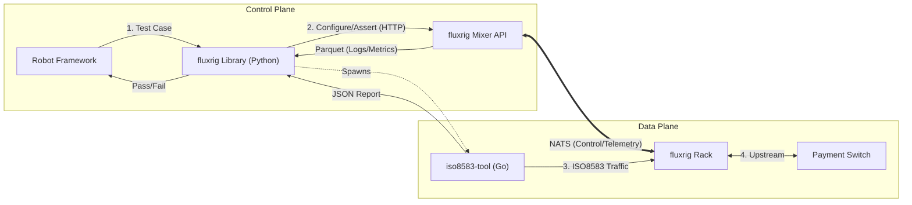

# Robot Framework reference

**fluxrig** integrates with **[Robot Framework](https://robotframework.org/)** to enable keyword-driven Acceptance Testing. This allows QA engineers, Product Owners, and Developers to define test scenarios in simple English without needing to write Go code.

> [!IMPORTANT]
> This integration provides a foundation. Users can use the same keywords and libraries that check the **fluxrig** platform to build their own end-to-end simulation and validation environments.

> [!NOTE]
> For the philosophy behind our testing approach, see the [Testing & Simulation Architecture](../architecture/testing_simulation.md).

## Integration architecture

Five specialized Python libraries (under `test/robot/lib/`) form the **fluxrig** integration. They orchestrate the test environment:

1.  **`fluxrigLibrary`**: Manages infrastructure lifecycle (Start Mixer / Start Rack, enrollment and adoption) and health checks.
2.  **`ISO8583Library`**: Load generation and protocol assertion, plus scheme/endpoint simulators (`start_load_generator`, `start_echo_server`).
3.  **`ToxiProxyLibrary`**: Network fault injection (latency, disconnects) for resilience and failover tests.
4.  **`NATSLibrary`**: Direct bus interaction for publishing/subscribing to `flux.msg.>` signals.
5.  **`TelemetryLibrary`**: Asserts emitted telemetry (Parquet/DuckDB) matches expected behavior.

1.  **Orchestration**: Robot Framework communicates with the **Mixer API** (HTTP) to configure the environment and assert state.
2.  **Telemetry verification**: The library reads **Parquet/DuckDB** data generated by the Mixer to check that system behavior matches expectations (e.g., specific logs or metrics).
3.  **Traffic generation**: For payments, it spawns `iso8583-tool` (Go) to drive traffic.



## Standard libraries and keywords

The **fluxrig** test suites use these specialized Python libraries. To use them in a test suite, include the ones you need in the `*** Settings ***` section:

```robot
*** Settings ***
Library    fluxrigLibrary
Library    ISO8583Library
Library    NATSLibrary
```

These libraries provide the following high-level keywords:

## Messaging

| Keyword | Library | Description |
| :--- | :--- | :--- |
| `Run Native Load Test` | `ISO8583Library` | Spawns `iso8583-tool` (Go) for load generation. |
| `Build ISO Message` | `ISO8583Library` | Packs one exact ASCII message from named fields. |
| `Acceptor Location` | `ISO8583Library` | Composes `DE 43` with the country in its last two characters. |
| `Send ISO Message` | `ISO8583Library` | Sends one framed message and returns the reply as hex. |
| `Publish Flux Msg` | `NATSLibrary` | Publishes a dictionary as a CBOR-encoded fluxMsg to NATS. |
| `Subscribe And Expect` | `NATSLibrary` | Blocks until a specific key/value pair is received or timeout occurs. |

### Sending one exact message

The load generator builds its own traffic, which is what a benchmark needs and
the opposite of what a functional test needs. A test asserting that a particular
card produces a particular outcome has to choose every field, so these three
keywords cover the other case.

```robotframework
${location}=    Acceptor Location    SHOP    UY
${msg}=    Build ISO Message    0100
...    f2=4111111111111111    f11=000101    f41=TERM0001    f43=${location}
${reply}=    Send ISO Message    ${msg}    target=127.0.0.1:8583    header_len=2
```

Name fields `f<N>` because Robot arguments cannot start with a digit. The library emits only the primary bitmap, covering fields 1 to 64. `header_len` is the size
of the big-endian length prefix that frames the message. It matches the gear's
`frame_length_size`.

`Send ISO Message` sends the bytes verbatim and reads the reply without parsing
or rebuilding it. Therefore a difference between what goes out and what comes back is
the system under test rather than the harness. That makes it usable for
byte-level fidelity work.

**Fixed alphanumeric fields: you must supply them at their exact declared length.**
The system does not pad them for you, and `DE 43` is the reason. Its country occupies the
last two characters, so right-padding a short value would silently move the
country out of the position a comparison reads. The test would pass or fail
for the wrong reason. `Acceptor Location` composes that field correctly. A
field of the wrong length raises. The system does not adjust it.

The system left-pads numeric fields with zeros to their declared width, since the ISO 8583 specs here declare this.

## Assertions

| Keyword | Arguments | Description |
| :--- | :--- | :--- |
| `Assert Success Rate Above` | `report`, `percentage` | Verifies the success rate from the load report. |
| `Assert Latency P99 Below` | `report`, `ms` | Verifies P99 latency is below threshold. |

## Usage examples

## Performance load test (baseline)

This example demonstrates how to orchestrate a load test:

1.  **Configure**: Configure the mixer/rack.
2.  **Execute**: Run the native Go load generator.
3.  **Check**: Assert performance metrics (latency, success rate).

```robot
*** Test Cases ***
Baseline Load Test (100 TPS)
    [Documentation]    Runs a 10s load test at 100 TPS.

    # 1. Start Environment
    Start Mixer    config_file=mixer.toml    work_dir=${WORK_DIR}
    Start Rack     config_file=rack.toml     work_dir=${WORK_DIR}
    Wait For Rack Registration    mixer_port=8090    rack_name=node-1

    # 2. Run Load (Go Tool)
    # Spawns 'iso8583-tool' process
    ${report}=    Run Native Load Test
    ...    target=localhost:8583
    ...    rate=100
    ...    duration=10s

    # 3. Validation
    Assert Success Rate Above    ${report}    99.9
    Assert Latency P99 Below     ${report}    100
```


## Standard ISO8583 test suites
The platform includes several pre-configured **Robot Framework** suites in the source `test/robot/suites/` directory. They serve as validation for the platform and as templates for user implementations:

| Suite | Focus | Key Scenarios |
| :--- | :--- | :--- |
| **`server_validation`** | Functional | Loopback validation, MTI routing, and **Header Preservation**. |
| **`server_staged_load`** | Performance | Baseline (100 TPS) vs. Stress (1000+ TPS) performance curves. |
| **`resilience`** | Chaos | Node failover, NATS link severance, and connection recovery. |
| **`coatcheck_loop`** | Pattern | Asymmetrical request/response routing via the **Coat Check** pattern. |

---

## Running tests

Suites use a Make target, which builds the binaries first and refuses to
run against stale ones:

```bash
# Every functional suite
make test-robot

# One suite: there is a target per directory under test/robot/suites/
make test-robot-iso
make test-robot-roaming
make test-robot-conductor
```

`make help` lists them all. The load and chaos suites (`test-robot-perf`,
`test-robot-roaming-stress`) have targets of their own and stay out of
`test-robot`. They fit a quiet machine and become noise inside a batch
run.

## CI/CD integration
The execution outputs a standard `output.xml` result file in the `results/` directory. The **fluxrig** acceptance tests thus integrate programmatically with major CI/CD pipelines (Jenkins, GitLab CI, GitHub Actions) through standard Robot Framework plugins. They generate interactive HTML reports and historical trends.